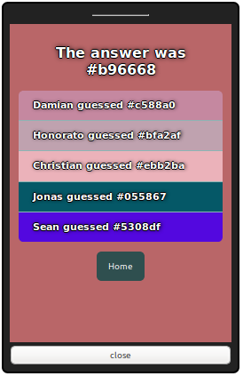

Hexliterate
===========

Hexliterate is a fun game: each player opens it with their browser (ideally on their phone). A random color is shown on the screen and everyone must guess the closest hexadecimal code for this color!

## Try it online

A demo is running at https://hex.s10a.dev/

## Run with Docker

    docker run -p 8000:8000 -v hexliterate:/var/data ssimono/hexliterate

The little server is powered by the great [websocketd](http://websocketd.com/) and you can pass extra options to it via environment variables with `WSD_` prefix.
Ex: `WSD_LOGLEVEL=debug` will pass `--loglevel=debug` to websocketd

## Run from source

1. Install the requirements: [websocketd](http://websocketd.com/) and [node js](https://nodejs.org/en/)
2. `git clone` and `cd` into the project
3. Build the assets with `make` (use `watch make` rebuild upon changes)
4. Launch the server with `make up`
5. Open http://127.0.0.1:8000

You can also open `/debug.html?phones=2` to simulate multiple phones
